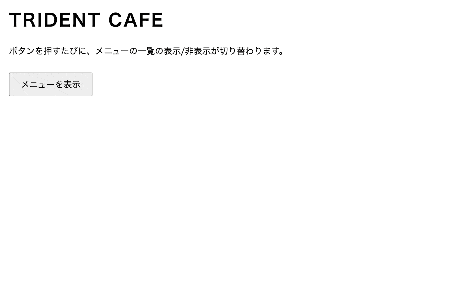

# jsQuiz-neo-09

「配列の**分割代入**（`const [a, b] = ...`）で取り出したデータを使う」「**map** で配列を HTML に変換する」の振り返りです。
この2つは、このあと学ぶ **React で毎回使う書き方**（`const [count, setCount] = useState(0)`・一覧の描画）そのものです。

## 課題内容

カフェのメニューデータ（配列の配列）が JavaScript に用意してあります。
ボタンを押すたびに、メニューを `map` で `<li>` の一覧に変換して表示 ⇔ 非表示（トグル）します。

**データ・ボタンのクリック処理・画面への流し込み・関数の骨組み（分割代入を含む）は `index.html` にすでに用意してあります。**
あなたの課題は、**`renderMenu` の中の `return ''` をテンプレートリテラルに書き換えて完成させる**ことだけです。



### HTML の構造（ひな形）

- トグルボタン … `<button class="menu-toggle-btn">`（ラベルは「メニューを表示」⇔「メニューを閉じる」に切り替わる・用意済み）
- メニューの表示先 … `<ul class="menu-list">`（最初は空）

### 用意済みの処理（書き換えないこと）

`index.html` の `<script>` 前半に、以下がすでに用意されています。

- メニューのデータ（**配列の配列**。1品は `[名前, 値段, 絵文字]` の並び）

  ```js
  const menu = [
    ['カフェラテ', 480, '☕'],
    ['抹茶ラテ', 520, '🍵'],
    // ...全6品
  ];
  ```

- ボタンの `click` イベントで表示/非表示をトグルする処理。表示するときに、あなたが作る `renderMenu(menu)` の結果を `.menu-list` に流し込む

  ```js
  button.addEventListener('click', function () {
    if (list.children.length === 0) {
      list.setHTML(renderMenu(menu));
      button.textContent = 'メニューを閉じる';
    } else {
      list.setHTML('');
      button.textContent = 'メニューを表示';
    }
  });
  ```

  > **`setHTML()` について**
  >
  > `innerHTML` の安全版です。`innerHTML` は渡された文字列をそのまま HTML にするため、`<script>` タグや `onclick` 属性などが混ざっていても実行されてしまい、**XSS（クロスサイトスクリプティング）攻撃**の原因になります。`setHTML()` は流し込む前に危険な部分を自動で除去（**サニタイズ**）してくれる、新しい標準メソッドです。
  >
  > - 参考: [Element: setHTML() メソッド - MDN](https://developer.mozilla.org/ja/docs/Web/API/Element/setHTML)
  > - 対応ブラウザ: **Chrome / Edge / Firefox**（2026年7月現在）
  > - **⚠️ Safari は未対応**です。Safari で開くとボタンを押してもメニューが表示されません。
  >   **動作確認は必ず Chrome で行ってください**（自動判定も Chromium で実行されるので、Chrome で動けば OK です）。
  >
  > **覚えておいてほしいこと**: Safari が未対応である以上、`setHTML()` は**実際の Web サイトにはまだ導入できません**（この課題は Chrome 前提の教材なので採用しています）。それでも、**「`innerHTML` に文字列を流し込むのは危険な操作だ」という意識**は今から持っておいてください。実務で今できる対処法は次のとおりです。
  >
  > 1. 文字列を**表示するだけ**なら `textContent` を使う（HTML として解釈されないので、そもそも危険がない）
  > 2. タグ構造が必要なら `createElement()` + `append()` で **DOM を直接組み立てる**（文字列で HTML を作らない）
  > 3. `innerHTML` を使ってよいのは、**自分で用意した安全なデータだけを流し込むとき**。ユーザーが入力した文字列や外部 API から受け取った値を、そのまま混ぜてはいけない
  > 4. 外部由来の HTML をどうしても流し込む必要があるなら、[DOMPurify](https://github.com/cure53/DOMPurify) などの**サニタイズライブラリ**を通してから使う

この**呼び出し側（データと表示処理）は完成済み**なので、**書き換えないでください**。あなたが書き換えるのは下記の `renderMenu` の中だけです。

### あなたの課題

`renderMenu(items)` を完成させてください。骨組みはここまで用意してあります。

```js
function renderMenu(items) {
  const elements = items
    .map((item) => {
      const [name, price, emoji] = item;
      // ↓ ここを書き換える（課題）
      return '';
    })
    .join('');
  return elements;
}
```

- メニューの配列 `items` を、`map` で1品ずつ `` `<li>${emoji} ${name}：${price}円</li>` `` の形の**文字列**に変換し、`join('')` で**1つの文字列**につなげて返す関数です。
- `map` が終わった時点では「`<li>...</li>` の文字列が6個並んだ**配列**」です。画面に流し込めるのは1本の文字列なので、**`.join('')`（配列を区切りなしで1つの文字列に連結する）を必ず入れてあります**。
- あなたが書き換えるのは **`return ''` の行だけ**。`''` を、`name` / `price` / `emoji` を埋め込んだテンプレートリテラルにすると完成します。
- 表示例: `☕ カフェラテ：480円`（コロンは全角の `：`）

---

## 制作手順（ヒント）

用意済みの骨組みには、React に入る前に読めるようになってほしい書き方が詰まっています。

1. `const [name, price, emoji] = item;` … 配列の**分割代入**（用意済み）
   - `item[0]` / `item[1]` / `item[2]` と書く代わりに、**配列の並び順どおり**に3つの変数へまとめて取り出している。
   - React では `const [count, setCount] = useState(0);` のように**この書き方を毎回見る**ので、読めるようにしておくこと。
2. `map`（用意済み） … 配列を**1品ずつコールバックに渡し**、コールバックが `return` した値が並んだ**新しい配列**を作る
   - つまり `map` が終わった時点では「`<li>...</li>` の文字列が6個並んだ**配列**」。まだ1本の文字列ではない。
   - `return` が2つあるのは**階層が違う**ため。`map` の中の `return` は「**この1品を何に変換するか**」（コールバックの返り値）、最後の `return elements;` は「**renderMenu 関数全体が何を返すか**」。中の `return` を消すと `undefined` が6個並んだ配列になり、画面には何も出ない。
   - React でよく見る `items.map((item) => <li>...</li>)` に `return` が無いのは、アロー関数の**省略形**（`{ }` を書かない形は式の結果がそのまま返る）だから。`{ }` を書く形なら React でも `return` は必要。
3. `.join('')`（用意済み） … **配列を1つの文字列に連結する**メソッド。引数が「区切り文字」
   - 例: `['あ', 'い', 'う'].join('')` → `'あいう'`
   - 画面に流し込めるのは配列ではなく1本の文字列なので、区切りなし `''` で連結している。
   - `join()` と引数を省略すると `,`（カンマ）区切りで連結されて、画面のメニューの間にカンマが出てしまうので注意。
4. あなたが書き換えるのは `return ''` の行だけ
   - `''` を、テンプレートリテラル（バッククォート `` ` ``）の中に `${name}` のように3つの変数を埋め込んだ `` `<li>${emoji} ${name}：${price}円</li>` `` にする。
   - `return ''` のままだと変換結果が空文字なので、ボタンを押しても画面には何も表示されない。書き換えてからもう一度押すと、メニューが表示される。

---

## 提出方法

### ① Fork
このリポジトリを自分のアカウントに Fork してください。

### ② clone
自分の Fork を GitHub Desktop で clone します。

### ③ branch を作る
ブランチ名に「quiz9/自分の名前」を記入する（例：quiz9/kawaguchi）

### ④ コードを書く
`students/{自分の番号}/index.html` を編集して課題を完成させます。
（例：出席番号が 7 番なら `students/7/index.html`）

ルートの `index.html` を `students/{自分の番号}/index.html` にコピーしてから編集するのが簡単です。

### ⑤ commit / push
変更を commit して push してください。
- title：出席番号_名前（例：28_河口）
- message：提出します。

### ⑥ Pull Request を作成
元のリポジトリに向けて Pull Request を作成してください。

## 判定について

- Pull Request を出すと自動判定が実行されます
- 成功 → ✅ **合格！** のコメントが付きます
- 失敗 → ❌ **不合格** のコメントと確認ポイントが付きます

結果は PR のコメント欄と「Checks」タブで確認してください。

## ディレクトリ構成

```
jsQuiz-neo-09/
├── index.html              # 問題ファイル（参照・複製元）
├── students/               # 解答フォルダ ★ここに作業する
│   └── {自分の番号}/
│       └── index.html      # index.html を複製して解答を記述
├── .github/                # 自動判定の設定（触らない）
├── tests/                  # 自動判定の設定（触らない）
├── playwright.config.js    # 自動判定の設定（触らない）
└── README.md
```

## 注意

- `students/{自分の番号}/index.html` の `<script>` 内、**「ここから下があなたの課題です」〜「ここまでがあなたの課題です」の間**だけ編集してください
- 用意済みの処理（`menu` のデータ・ボタン処理・`setHTML` での流し込み・`renderMenu` の骨組み＝分割代入の行と `map`/`join`）は書き換えないでください
- HTML構造（`.menu-toggle-btn` / `.menu-list`）は変えないでください
- メニューの品名・値段・絵文字や `[名前, 値段, 絵文字]` の並び順は変更しないでください
- `students/` 以外のファイルは変更しないでください
- エラーが出たら修正して再度 push してください

---

## 模範解答

授業資料の[JSQuiz_neo模範解答](https://2026doc.hideok.org/first-term/javascript/post-quizanswer)
